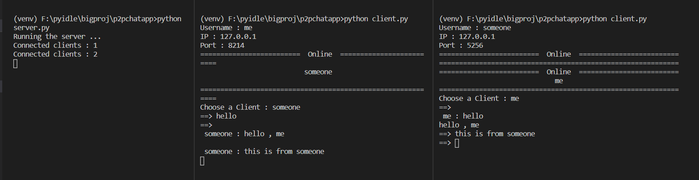

# PP chat

**_it's a simple peer to peer chat application using twisted module from python3. Even though its a p2p app, server is still used here to get all the connected clients host and port number and send it to other clients_**

### usage

- pip install -r requirements.txt
- python server.py
- python client.py
- python client.py in another terminal

